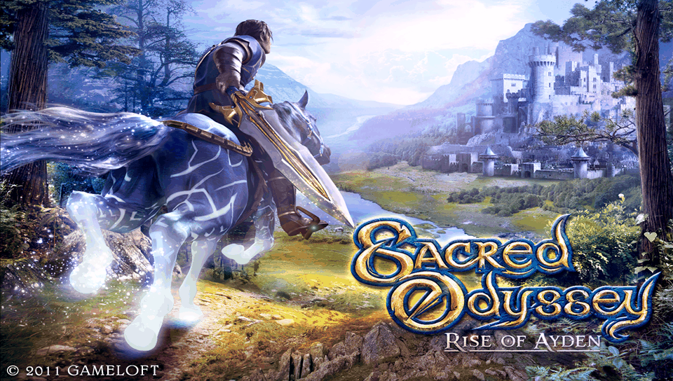

# Sacred Odyssey: Rise of Ayden — PS Vita Port

<p align="center">
  
</p>

<p align="center">
  
  
  
</p>

Native port of **Sacred Odyssey: Rise of Ayden** (Android, `com.gameloft.android.ANMP.GloftSOHP.ML`,
Gameloft **Glitch** engine) to the PS Vita. Runs the original `libsacredodyssey.so` unmodified through
a [SoLoader](lib/so_util) + [FalsoJNI](lib/falso_jni) bridge — no game logic was reimplemented, only
the Android/JNI/OpenGL ES layer underneath it.

## Status

- ✅ **Playable (v1.0.2, see [`RELEASE_NOTES.md`](RELEASE_NOTES.md)).** The game boots,
  loads saves, and is fully playable from start to finish with a physical controller, although it is
  still in development and has one known open issue (erratic FPS, see below).
- 🎮 **Full physical control mapping** (`source/controls.c`): left stick / D-Pad for 360° movement
  (radial deadzone), right stick for smooth analog camera rotation calibrated against N.O.V.A. 2 and
  Shadow Guardian (quadratic response curve, eliminated camera snapping/resets, infinite 360° continuous rotation,
  works without touching the screen), and every face button / trigger mapped to its HUD widget — attack, shield,
  horse mount/dismount, minimap, pause and in-game menus. Touch screen keeps working in parallel (5 shared slots).
  Pressing **L+R together** reveals the full virtual HUD at full opacity.
- 🖥️ **HUD reorganized for console play:** menu icon, character portrait/health, minimap and the
  weapon-switch icon stay at full opacity at all times; the rest of the touchscreen HUD is dimmed to
  the background (still touchable) instead of covering the screen.
- 🔊 **Real audio:** the engine's native VOX middleware is bridged from `android/media/AudioTrack`
  to `sceAudioOut` (44.1 kHz stereo 16-bit, dedicated output thread) — the game is no longer mute.
- 🎨 **Graphics fixes:** the black patches on the character/mount were traced to the second texture
  of `MULTITEXTURED` materials being an *additive reflection (envmap)* map, not a multiplicative
  detail layer as first assumed — the embedded shader now adds it scaled by `envmapIntensity`
  instead of multiplying. Missing effect shaders (`Unlit*`, `ProfileCOMMON_emul_*`) are provided
  from reconstructed sources embedded in the eboot, so they work without reinstalling the `.vpk`.
- ⚡ **Loading improvements:** two real stalls inside `World::LoadMap()` (the game-object loop and
  the graphical-maps loop both blocked the frame without yielding) now yield periodically, plus a
  64 MB RAM file cache with LRU eviction, kernel I/O cache tuning and a persistent vitaGL shader
  cache — stage transitions no longer feel like a total freeze.
- 🩹 **Stability fixes:** a crash in World 10 cutscenes when redirecting missing textures already in RAM cache,
  crashes when mounting the horse (dangling `HudWidget*`, now guarded by alignment + plausibility checks),
  a Triangle-button crash from a stale widget-table entry, a file cache corruption during autosave/stage
  transitions, a cutscene fade-material crash, plus the boot-time `Gameplay::s_instance` / `FileManager` /
  license-check crashes from the initial bring-up. Every one was root-caused from a real console crash dump —
  see [`port_progress.md`](port_progress.md).
- ⚠️ **Known issue:** erratic FPS — framerate fluctuates during normal gameplay (worse in
  boss-fight combat with heavy particles). The two hard load stalls are fixed; the remaining
  fluctuation is still under investigation with targeted telemetry.
- 🔬 **Known trade-off:** skinned/animated meshes render in bind pose — the hardware-skinning
  uniform arrays were removed on purpose after they caused a harder crash (per-mesh bone-count
  mismatch), so those meshes log a bind-symbol warning instead of crashing. A real fix requires
  generating the shader per material's bone count.
- 📋 Full engine findings and porting plan in [`PORTING_PLAN.md`](PORTING_PLAN.md).

## Requirements

- A PS Vita or PSTV on Henkaku/Ensō (or h-encore²/rejuvenate on recent firmware).
- `kubridge` installed (`kubridge.skprx`) — explicitly checked at boot, see `source/utils/init.c`.
- `libshacccg.suprx` installed (required by any homebrew using `vitaGL`/`SceShaccCg` to compile GLSL
  shaders at runtime).
- A legitimate copy of the original Sacred Odyssey: Rise of Ayden Android APK/data. This repository
  does **not** include or distribute the APK, the `.so`, or the game's assets (see `.gitignore`) — only
  the port's loader code.

## Installation

1. Install the generated `.vpk` (`build/sacredodyssey.vpk`) with VitaShell.
2. From the original Android install, copy the following to `ux0:data/sacredodyssey/` on the Vita:
   ```text
   ux0:data/sacredodyssey/
   ├── libsacredodyssey.so
   ├── res/            (drawable, layout, raw)
   └── GloftSOHP/
       └── data/       (3d, 2d, audio, menus, automat, ...)
   ```
3. Launch the game. The first run creates its own saves/logs under
   `ux0:data/sacredodyssey/saves/` and `ux0:data/sacredodyssey/logs/`.

## Controls

| Vita | In-game action |
|---|---|
| Left stick / D-Pad | Movement (360°, radial deadzone) |
| Right stick | Smooth analog camera rotation (calibrated quadratic curve, 360° continuous rotation) |
| ✕ (Cross) | Sword / melee attack |
| ○ (Circle) | Defense / shield (never opens menus) |
| △ (Triangle) | Mount / dismount horse |
| □ (Square) | Minimap |
| L Trigger | Defense / shield, or target lock |
| R Trigger | Mount / dismount horse |
| L + R together | Reveal the full virtual HUD at full opacity (press again to dim it back) |
| START | Pause / system menu |
| SELECT | In-game menu / weapon switch |
| Front touch screen | Full native multitouch, works in parallel with the physical buttons above (5 shared slots) |

Menu icon, character portrait/health, minimap and the weapon-switch icon are always shown at full
opacity; the rest of the touchscreen HUD is dimmed to the background (still fully touchable — dimming
only changes alpha, never the visible/active flags the touch hit-test needs; see `source/controls.c`).

### Camera Sensitivity Configuration

Right stick camera sensitivity is adjustable via an optional configuration file:
- File path on Vita: `ux0:data/sacredodyssey/camera_sens.txt`
- Values: integer from `1` to `10` (default is `5` = 100% standard speed).
- Created/edited with VitaShell or any text editor.

## Building from source

Requires [VitaSDK](https://vitasdk.org/) installed and on your `PATH`.

```sh
export VITASDK=/path/to/vitasdk
export PATH="$VITASDK/bin:$PATH"

mkdir -p build && cd build
cmake .. -DCMAKE_BUILD_TYPE=Release
make -j$(nproc)
```

It can also be built/deployed with `psvita-port-toolkit` (see below):

```sh
psvita-toolkit build --preset release
psvita-toolkit deploy --vpk
```

## Repository layout

- `source/` — the loader: `main.c` (lifecycle + render loop), `controls.c` (physical input mapping
  + HUD management), `audio.c` (AudioTrack → `sceAudioOut` bridge), `patch.c` (binary compatibility
  patches against the original `.so`), `java.c` (FalsoJNI method table), `dynlib.c` (symbol
  resolution), `reimpl/io.c` (file I/O + shader/texture asset redirects + RAM cache),
  `utils/glutil.c` (vitaGL wrappers, embedded-shader substitution, texture-unit guards),
  `utils/embedded_shaders.c` (reconstructed GLSL sources embedded in the eboot).
- `lib/so_util`, `lib/falso_jni` — SoLoader + FalsoJNI framework.
- `lib/fios` — FIOS2 kernel I/O cache (tuned up for this port's asset streaming).
- `lib/vitagl` — vendored [vitaGL](https://github.com/Rinnegatamante/vitaGL) submodule, built from
  source (`SOFTFP_ABI=1 NO_SPLASHSCREEN=1 HAVE_SHADER_CACHE=1` + perf flags, see `CMakeLists.txt`).
- `extras/shaders/` — reconstructed GLSL shader sources, mirrored by the embedded copies in
  `source/utils/embedded_shaders.c` so they install themselves on first run.
- `decompiled/` — decompiled Java (jadx) and pseudo-C (Ghidra) of the original `.so`, used for crash
  triage (gitignored, regenerable).
- `RELEASE_NOTES.md` — what each release contains and its known issues.
- `PORTING_PLAN.md` — living porting plan, updated as real engine details get confirmed.
- `port_progress.md` — bug log, one confirmed bug at a time, each with its real root cause and fix.
- `.psvita-toolkit.json` — configuration for `psvita-port-toolkit`, the standalone tool that manages
  this port's build/deploy/logs/LiveArea/crash dumps.

This port does not keep a local copy of `porting_tools/` — all build/deploy/debug work goes through
**psvita-port-toolkit**, outside this repository.

## Development workflow

1. Analyze the `.so`'s symbols before touching the loader (engine: Gameloft Glitch, GLES2 programmable
   pipeline, `.bdae`/Collada-derived models, `ALicenseCheck` anti-tamper).
2. Bootstrap the loader (SoLoader + FalsoJNI + Bionic↔VitaSDK ARM compatibility patches).
3. Build/deploy via `psvita-port-toolkit` → real hardware.
4. One confirmed bug at a time, cross-referencing a real log + `.psp2dmp` + Ghidra pseudo-C +
   decompiled Java source — never a speculative patch without evidence.
5. Every confirmed bug gets documented in `port_progress.md` with its root cause.

## Credits

- **Sacred Odyssey: Rise of Ayden** and its engine (Gameloft Glitch) are property of **Gameloft** — this
  repository makes no claim of authorship over the original game.
- **Andy "TheFloW" Nguyen** for the original Android `.so` loader concept.
- **Rinnegatamante** for [vitaGL](https://github.com/Rinnegatamante/vitaGL) and invaluable soloader
  contributions.
- **Volodymyr Atamanenko** for the soloader boilerplate and FalsoJNI framework.

## License

This port's code is MIT-licensed (see [`LICENSE`](LICENSE)). The game and all of its assets (graphics,
audio, text, `libsacredodyssey.so`) remain the property of **Gameloft** and are **not** distributed in
this repository — you need your own legitimate copy of the game's data to use this port.
